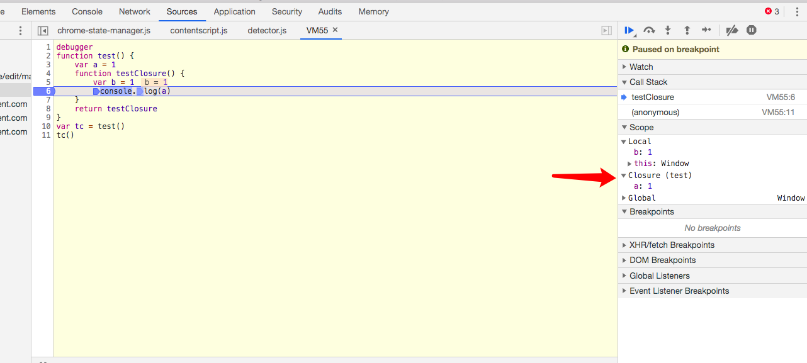

### 作用域
作用域是一套对变量进行存储和访问的规则。JavaScript 采用了词法作用域（lexical scope），也就是静态作用域。
词法作用域是在代码书写阶段确定，而与之相对的概念有动态作用域，它是在运行时确定的。例如：
```javascript
var value = 1;

function foo() {
    console.log(value);
}

function bar() {
    var value = 2;
    foo();
}

bar();
```

上述代码由于 JavaScript 使用的是词法作用域，所以最终打印结果为 1。这是因为词法作用域会先让函数 foo 现在当前作用域中查找是否有 value，如果没有则到全局作用域中查找，所以最终返回的结果为 1.
而动态作用域不会关心代码的书写位置，只关心函数的调用。所以如果 JavaScript 使用的是动态作用域，则此时会打印出 2。这是因为函数 foo 的作用域中没有找到变量 value，它会从调用 foo 的作用域中查找，也就是 bar 函数的作用域，所以结果就为 2。

### 作用域链
在 JavaScript 标准中，作用域是由词法环境（lexcial environment）实现的。词法环境主要包含两部分:
- 环境记录（environment record）：存储变量和函数声明的实际位置
- 对外部词法环境的引用（outer）：可以访问其外部词法环境

作用域：当访问一个变量是，如果当前作用域中没有找到该变量，则解释器会从根据 outer 去访问外部环境的作用域，直到全局作用域为止，这就是作用域链。

### 闭包
MDN 中对闭包的定义：函数与对其状态即词法环境（lexical environment）的引用共同构成闭包（closure）。由此可知：
闭包 = 函数 + 对外部词法环境的引用

而外部环境引用是函数词法环境的组成部分，它会在函数调用时创建，所以从技术角度看，只要调用一个函数，就会创建一个闭包。但这并不是我们通常讲的闭包，我们常说的闭包包含两个条件：
1. 即使创建它的上下文已经销毁，它仍然存在（比如，内部函数从父函数中返回）
2. 在函数中引用了外部环境的变量

```JavaScript
debugger
function test() {
    var a = 1
    function testClosure() {
        var b = 1
        console.log(b)
    }
    return testClosure
}
var tc = test()
tc()
```

由下图可知，由于 testClosure 并没有引用外部环境的变量，所以这里并没有闭包产生。


但当我们把代码改成如下所示时：
```JavaScript
debugger
function test() {
    var a = 1
    function testClosure() {
        var b = 1
        console.log(a) // 引用了外部词法环境的变量
    }
    return testClosure
}
var tc = test()
tc()
```

则满足了我们常规闭包的定义，所以这时就会创建出闭包



